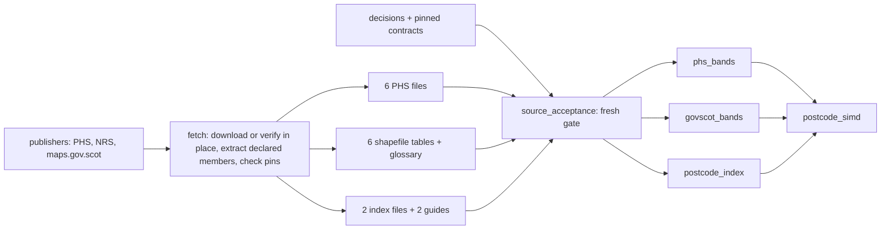

# Postcode-SIMD pipeline on Dagster: stepwise implementation plan

> Historical proposal. The text below records the design at the time, not today's runtime.
> Start a current review at [How it is built](../HOW_IT_IS_BUILT.md); current policy is in
> [decisions.yaml](../../simd_ingest/decisions.yaml). Population diagnostics and split-lookup
> defaults described here have since been superseded.

Prepared and review-revised 10 September 2026. Seven steps, each reviewed and approved
before the next begins. Status: plan only; no step is implemented or approved by this edit.

The pipeline must be simple enough to read in one sitting. Dagster is a thin declaration
layer that records lineage, provenance and check results. All data logic stays in plain
Python functions that run and test without Dagster.

This is the current delivery plan, replacing the orchestration and first-delivery scope
of the [Snakemake plan](SIMD_Snakemake_Implementation_Plan.md). The
[gap-closure evidence](SIMD_Plan_Gap_Closure.md), source registry and reviewed acceptance
baselines remain authoritative for the downloaded data, except that baselines referencing
the four retired government pins are re-reviewed in step 2. This version includes acquisition:
every pinned source is downloaded from its publisher into a workflow-owned cache and verified
against its pin, with an offline mode that uses pre-supplied files under the same contract.
The machine-readable sources were verified on 10 September 2026; see
[source API options](SIMD_Source_API_Options.md).

## What is deliberately left out of this version

Each of these can be added later. None is needed to produce a validated, fully
provenanced table from the pinned sources.

| Left out | Why |
| --- | --- |
| Partitions by edition or release | One current release and six attached editions. Reconsider only when there is a partitioned use case; a replacement release alone does not require partitions. |
| SQL Server and DuckDB targets | Parquet plus manifest is the deliverable. A database load is a downstream consumer of a validated file. |
| Historical data snapshots and automatic rollback | Retain one current Parquet, run history and small immutable evidence records, not a historical copy of every table. Validate before replacement and detect a mismatched sidecar manifest. |
| Long postcode-by-edition bridge | The wide table answers the questions asked so far. |
| Percentile | Omit from this version across all six editions. Published values exist for 2011 data zones, but not 2001; this explicitly replaces the older plan's partially populated percentile fields. |
| Materialised candidate counts per ordinary postcode | A count stored on every row goes stale the moment the table is filtered. Ambiguity is exposed by a query instead. |
| Patient linkage and ntile resolver | Preserve the agreed consensus policy below, but do not implement patient linkage in this ingestion delivery. |

## Frozen target contract

- One `results/postcode_simd.parquet`, containing **247,773 records** from both user types
  in SPD 2026/2. A future accepted release replaces the entire snapshot; never append it.
- Natural primary key **`(pc_norm, introduced_on)`**, non-null and unique across both
  user types. `spd_release` is an attribute, not a key component. Validate every release.
- **162 columns:** the 65-column union of original postcode fields, the seven derived
  fields below, six PHS geography fields, and 14 SIMD fields per edition for six editions.
  Freeze ordered names, Arrow types and field-specific nullability in
  `simd_ingest/output_schema.yaml` in step 1.
- Preserve original postcode text, leading zeros, dates and source blanks as strings.
  A blank supplied by a source remains `""`; a field absent from that user type is null.
- The seven derived fields are `pc_norm`, `pc_base`, `spd_user_type`, `spd_release`,
  `introduced_on`, `deleted_on`, `is_current`. Keep `pc_base` in this reference table.
  Normalisation removes ASCII spaces and uppercases; `pc_norm` retains NRS suffixes.
  Only a structurally validated A/B/C suffix on a flagged small-user record is removed
  for `pc_base`; a large-user split flag never shortens its own postcode.
- Each edition adds rank, eight canonical PHS bands, two unchanged 15% flags and three
  published government bands. Join 2004-2012 through `DataZone2001Code`, and 2016/2020v2
  through `DataZone2011Code`, never through the directory's 2022 geography.
  Require all 84 attached SIMD values and the six PHS geography codes to be non-null for
  every record in this pinned release.
- **Band column names state the weighting**, following the PHS deprivation guidance rule
  that population-weighted and unweighted categories must never be mixed and must always
  be identified. PHS population-weighted bands are `simd{ed}_pw_scotland_decile`,
  `simd{ed}_pw_scotland_quintile`, `simd{ed}_pw_hb_decile`, `simd{ed}_pw_hb_quintile`,
  `simd{ed}_pw_hscp_decile`, `simd{ed}_pw_hscp_quintile`, `simd{ed}_pw_ca_decile` and
  `simd{ed}_pw_ca_quintile`. Scottish Government unweighted bands are
  `simd{ed}_uw_scotland_quintile`, `simd{ed}_uw_scotland_decile` and
  `simd{ed}_uw_scotland_vigintile`. Rank and flags stay `simd{ed}_rank`,
  `simd{ed}_most15pc`, `simd{ed}_least15pc`. This replaces the prototype's
  `country_` and `gov_` names.
- **Six PHS geography fields** carry the health board, HSCP and council area code PHS
  assigned to each data zone when computing its within-geography bands:
  `phs_dz2001_hb`, `phs_dz2001_hscp`, `phs_dz2001_ca`, `phs_dz2011_hb`, `phs_dz2011_hscp`,
  `phs_dz2011_ca`. PHS uses one assignment per data-zone vintage across its editions, so
  three fields per vintage suffice. They differ from the directory's own 2019 codes on
  8 records for 2011 zones and on 35 (HB) or 86 (HSCP, CA) records for 2001 zones; the
  within-geography bands are only valid against the PHS code, so both are kept.
- **Table-level metadata records the band convention.** In the Parquet schema metadata
  and the manifest: every band column reads 1 as most deprived; the PHS 2004 and 2006
  population-weighted deciles and quintiles were re-derived from the published values,
  `11 - decile` and `6 - quintile`, so that they follow the ordering used by every other
  edition; ranks and the 15% flags are as published in all editions; `pw_` fields are PHS
  population-weighted, `uw_` fields are Scottish Government unweighted, and the two must
  not be combined in one analysis. The vigintile is available only unweighted.
- **The data dictionary carries the PHS guidance Table 4** mapping years of health data
  to the edition to use, labelled as a PHS recommendation from guidance v3.5, not encoded
  as a column. It also states that the file carries SIMD only and no Carstairs index.
- `deleted_on` is null for **162,049 current records**; introduction dates and keys are
  non-null. Validate source times are midnight before parsing explicit day/month/year
  dates. Historical validity is `[introduced_on, deleted_on)`, with null deletion open-ended.
- The 28 same-day records remain in the table but have no as-of match. In this seven-field
  schema, the same-day flag is a documented query expression; source file/record ordinals
  belong to internal trace evidence. These choices, omitted percentiles and omitted
  candidate counts explicitly replace the older 166-column proposal; the six PHS
  geography fields and the weighting-labelled names were added on 10 September 2026
  after review against the PHS deprivation guidance for analysts, version 3.5.

The agreed downstream ntile policy remains: select the relevant date-valid candidates
first and compare each exact edition/band/source/scope separately. Complete non-null
agreement resolves to `unique` or `split_consensus`; disagreement gives a null band with
`split_conflict`; missing values or unestablished coverage give `incomplete`; no candidates
give `not_found`. Missing/coverage checks precede consensus; `COUNT(DISTINCT)` alone is
insufficient. An omitted English border part is not evidence of agreement, and CHI
registration alone does not establish Scottish address coverage. Never choose A, average
or vote. Resolve to one lookup row per postcode/date and left join without losing or
multiplying patient rows; diagnostic statuses remain internal. This policy is recorded
now; its executable resolver and ntile-conflict counts are deferred, not claimed complete.

## Validation decision: source fidelity blocks; population reconstruction does not

Agreed with the user on 10 September 2026; implementation pending. The ingestion
guarantee is that the accepted source values are the values delivered in the saved
table, after the explicitly documented transformations. It is not a guarantee that our
population reconstruction reproduces the publisher's method.

- **Non-blocking diagnostic:** compare population-reconstructed bands and 15% flags
  with the published PHS values across all six editions. Record differences, including
  new or changed exception tuples, without stopping ingestion or publication. Published
  values remain authoritative; never replace them with reconstructed values. The
  Shetland cause remains unresolved, and its exact published values remain preserved.
- Record the edition, geography scope/code, population source/year/hash, method version,
  number compared, mismatch count and exact differing zone/value tuples. Distinguish
  published, direction-normalised and reconstructed values, and retain population totals
  and zero-population context. Report `match`, `difference` or `not_evaluated` with a
  reason; an unavailable reconstruction on otherwise valid inputs is not a passing check.
  Diagnostic differences or inability to reconstruct alone do not require approval to
  publish. Retain earlier exception baselines as evidence, not as a publication gate.
- **Blocking:** source hashes and required source integrity/schema checks; valid keys,
  types, ranges and null rules; correct data-zone vintage, join coverage and row counts;
  existing independent rank comparisons; and saved-output source fidelity. A missing,
  changed or invalid required source is not excused by the diagnostic policy.
- Reopen the saved Parquet and compare its supplied values with the accepted source
  lookups on the correct keys. Invert only the eight PHS band fields in 2004/2006 using
  `11 - decile` or `6 - quintile`; preserve ranks and 15% flags unchanged. Check the
  supplied PHS geography codes and raw postcode fields too. Do not use a population
  reconstruction as the expected output, or silently "correct" a published exception.
- Classify core check results explicitly as blocking or diagnostic. CLI exit status,
  the source-acceptance receipt and publication depend on blocking checks only. Show
  reconstruction differences as non-blocking warnings in Dagster and retain the full
  diagnostic report with the run evidence and manifest. Never describe a run with
  reconstruction differences as "all checks agree".

## Shape of the result

```text
simd_ingest/
  sources.yaml                pinned files, hashes, band routing        (exists)
  acceptance_baselines.yaml   fixed expectations, never regenerated     (exists)
  decisions.yaml              every judgement made, with date and why   (step 1)
  output_schema.yaml          ordered target fields, types, null rules  (step 1)
  core/                       plain Python, no Dagster imports          (step 1)
    sources.py                source registry, hashing and acceptance gate
    phs.py                    build phs_bands
    govscot.py                build govscot_bands from the shapefile tables
    spd.py                    build postcode_index
    join.py                   build postcode_simd
    checks.py                 check functions returning structured results
    fetch.py                  download, archive extraction, pin verification (step 2)
    publish.py                candidate readback, evidence, safe replacement (step 6)
    trace.py                  natural-key-to-source trace               (step 6)
  orchestration/              Dagster only                              (steps 3 to 6)
    definitions.py            the code location
    assets.py                 four table assets and source-acceptance gate
    checks.py                 asset checks wrapping core.checks
  cli.py                      same core; compatibility first, target by step 6
config/
  workflow.yaml               source_mode download|offline, source root  (step 2)
data/sources/                 workflow-owned cache of verified pins; not in git (step 2)
results/
  postcode_simd.parquet        current combined snapshot                 (step 6)
  manifest.json               current sidecar; verify it matches Parquet
  evidence/<run_id>/           retained manifests, reports, decisions and contracts
```

Four table assets plus a `source_acceptance` evidence asset. Their upstream source
assets are **every logical file in the registry plus the decision log**: 17 logical files
from 13 remote objects. Six PHS files, four members of the NRS archive, six shapefile
attribute tables and the 2020 glossary.
Each source asset is materialised by `core.fetch`, which downloads and verifies in
download mode or verifies in place in offline mode. Generate source definitions from
`sources.yaml`, including URL, remote object hash and archive member mapping; do not
maintain another file inventory. Configuration,
schema and baseline hashes are also recorded as build inputs. Intermediate tables are
internal, run-scoped artifacts, not additional published products.



This diagram shows acceptance dependencies. Add direct source dependencies to each
table/check according to the files actually consumed, distinguishing value suppliers,
independent validation references and documentation. In particular, each shapefile table's
population column supplies the non-blocking PHS reconstruction diagnostic, and the guides
and glossary supply evidence rather than table values.

## Step 1. Freeze decisions and schema; refactor without changing prototype output

No Dagster yet. This step makes the existing prototype ready to be declared as assets.

**Build**

- `decisions.yaml`: dated entries with reason, evidence pointer and implementation status.
  Cover the frozen contract and deferred ntile policy; only the eight PHS bands in 2004
  and 2006 are inverted, never ranks or 15% flags. Output bands are looked up; formulae
  remain permitted for independent validation, with population reconstruction diagnostic
  under the validation decision above. Record that decision as agreed-but-pending until
  both adapters implement it. Preserve the unresolved Shetland cause and exact published
  exceptions. Keep `NO LINKP` and `NO LINK` raw but classify both as
  no link; accept and identify the cut SPD edition. Government bands come from the six
  maps.gov.scot tables by one data-zone route for every edition; the two statistics.gov.scot
  extracts and the two gov.scot workbooks are retired pins, recorded with the evidence that
  their values were identical on every zone. The SIMD2009 table is the 2009v2 data.
- Freeze the target schema above without changing the prototype exports yet. Label
  compatibility behaviour separately from target behaviour; the schemas are not identical.
- Pin Python, pandas, NumPy, PyArrow, PyYAML, `dbfread` for the shapefile tables, openpyxl
  for the glossary and legacy workbooks, the HTTP client used by fetch, and the Dagster/UI
  dependency set;
  record platform and Parquet writer settings. Capture original output hashes for the
  refactor comparison without overwriting `out/` or regenerating expectations.
- Split `build.py` into importable `core/` functions and retain a compatibility entry
  point, including imports used by `acceptance.py`. Functions return structured check
  evidence where possible; invalid parsing or unsafe prerequisites raise a typed error.
  CLI and Dagster adapters must reject failed required checks, never log-and-continue.
- Add an explicit prototype-compatibility mode to the CLI, writing to a supplied test
  output directory. Preserve the existing source-acceptance command and its test suite;
  require fresh acceptance before supported builds, with no supported skip-hash bypass.

**Done when**

- The compatibility CLI reproduces both original Parquet hashes in the same verified
  environment, with the same 72 prototype checks. Never silently refresh these hashes
  to make the refactor pass; an unexplained writer/environment mismatch requires review.
- Existing source acceptance still passes its **369 checks over all 14 hashes**, and
  all **14 regression tests** pass. Preserve coverage, not merely these check counts.
  This is the legacy compatibility baseline; its blocking reconstruction-exception
  comparisons are explicitly reclassified for the target workflow in steps 3 and 4.
- Schema arithmetic is 65 + 7 + 6 + (6 x 14) = 162; decisions distinguish implemented,
  agreed-but-pending and deferred behaviour. Core modules import without Dagster.
- A failed prerequisite stops the compatibility CLI without publishing output. Tests
  use temporary fixtures/copies and leave `manual_data/` and original `out/` untouched.

**You review**

- The decision list. Is anything missing, wrong, or no longer what you want?
- The module split. Can you read `core/` top to bottom and follow it?
- The frozen target schema, compatibility-only differences and retained acceptance coverage.

## Step 2. Acquisition: download every pinned source and verify it against its pin

No Dagster yet. Plain Python in `core/fetch.py` with a CLI command; the Dagster wiring
comes in step 3. Fetch proves identity, not fitness: the acceptance gate still runs after it.

**Build**

- Extend `sources.yaml` with, per remote object: the direct URL, the expected SHA256 of the
  object as downloaded, its format (`file` or `zip`), and for archives the exact member to
  logical-file mapping. The existing per-file content hash remains the pin for each logical
  file. One registry; no second inventory.
- The remote objects, all verified reachable and hash-matching on 10 September 2026:

| Publisher | Remote objects | Logical files | Notes |
| --- | ---: | ---: | --- |
| PHS open data, CKAN | 6 dated CSV URLs | 6 | Filenames carry a date and have not changed since 2020; the URL is the version pin. CKAN exposes no content hash. |
| NRS | 1 ZIP | 4: two index CSVs, two guides | Rejects the default HTTP user agent; send a browser-style one. Flat archive, four members. |
| maps.gov.scot ATOM feed | 6 ZIP | 7: six `.dbf` tables, one glossary | Read `.dbf` with `dbfread`; ignore geometry members. The `.shp.xml` carries the Open Government Licence statement. The SIMD2009 table holds the 2009v2 ranks. |

  Thirteen remote objects, seventeen logical files.
- Retired pins, decided 10 September 2026: the two statistics.gov.scot extracts served
  through data.gov.scot, the rank-to-band workbook and the 2020v2 ranks workbook. Every value
  they supplied is present in the shapefile tables and was verified identical on every zone:
  bands for 2004 to 2016 against the extracts, 2020 bands against the workbook, and 2020
  population against the ranks workbook. Keep their hashes in `decisions.yaml` as evidence.
  Migrate the acceptance suite from the retired pins to the shapefile tables: the government
  checks in `acceptance.py` read the extracts and workbooks today and must read the `.dbf`
  tables instead, with baseline entries for the thirteen remote objects and seventeen
  logical files. Re-review every entry in `acceptance_baselines.yaml` that names a retired
  pin; the twelve divergence fingerprints keep their values because the published bands
  are identical. Keep the legacy suite runnable against `manual_data/` for step 1 evidence.
- Download into a workflow-owned cache under `data/sources/`, never into `manual_data/`.
  Write a temporary sibling, verify the object hash, then rename into place. A partial or
  mismatched download never receives the accepted filename. Bounded timeout, a small retry
  with backoff, and one log line per object with size, hash and outcome.
- Extract only declared members. Reject absolute paths, traversal, symlinks, duplicate names
  and undeclared members. Verify every extracted member against its logical pin. The archive
  is transport; the member is the source.
- Never update a pin on mismatch. Changed bytes fail with the observed hash and stop. A pin
  change is a reviewed registry edit with a `decisions.yaml` entry and re-reviewed baselines.
- `source_mode: download | offline` in `config/workflow.yaml`. Offline points the source root
  at pre-supplied files, initially `manual_data/`, and performs no network access; a missing
  file fails without fallback. Both modes finish in the same verified state, so no downstream
  code knows which mode ran.
- CLI: `fetch` downloads and verifies; `verify` hashes an existing root against the registry.
  Record licence per publisher in the registry: PHS OGL from its package metadata,
  maps.gov.scot OGL from `.shp.xml`, NRS terms to be confirmed before redistribution.
- Cross-check evidence, not a source: the PHS datastore API returns a frame identical to the
  pinned 2020v2 CSV, and the maps.gov.scot tables match PHS ranks, statistics.gov.scot bands
  and the ranks workbook population on every zone. Record these in `decisions.yaml`.

**Done when**

- From an empty cache in download mode, all remote objects fetch and every logical file
  matches its pin. The migrated acceptance suite passes over that root, and passes over
  `manual_data/` in offline mode with the same results.
- Offline mode over `manual_data/` reaches the same verified state with zero network calls,
  demonstrated with networking disabled.
- Fixtures with a wrong object hash, a truncated download, an HTML error page in place of a
  file, and an undeclared or traversing archive member each fail cleanly and leave nothing
  under an accepted name.
- A rerun on a populated cache downloads nothing and re-verifies everything.

**You review**

- The registry entries: are these the URLs you would pin, and are the licence statements
  recorded the way HIC needs them?
- The re-reviewed baseline entries: does each change trace to a retired pin, with the
  fingerprint values unchanged?

## Step 3. Dagster skeleton, source identities and a blocking acceptance gate

**Build**

- Configure a persistent instance outside disposable work paths, with run/event storage
  and a documented startup command. Configure the instance through the pinned Dagster
  deployment settings, not merely by declaring `Definitions`. Keep definitions import
  free of builds, observations, downloads and other data writes.
- Register every logical file in the registry as a source asset, plus `decisions.yaml`:
  eighteen assets. Generate the list from the registry.
  Reuse the complete registry reader in acceptance.
- One code path for both modes: materialising a source asset calls `core.fetch` for that
  logical file, which downloads and verifies in download mode or verifies in place in
  offline mode, and returns the content hash as the asset's `DataVersion`. Importing the
  definitions performs no network access; fetching happens only inside a run.
- Observe actual file SHA256/size and supply explicit source `DataVersion` values using
  the pinned API, not just a metadata field named `sha256`. Retain source roles and paths.
- Add a `source_acceptance` asset executing the migrated full source gate on every
  supported build, with the blocking/diagnostic classification above. The legacy
  `acceptance.py` fails on reconstruction-exception drift; adapt the core report and
  CLI exit logic, not merely the Dagster wrapper's severity. Preserve check coverage.
  It records observations/versions for the bytes checked and rejects
  any failed required check before returning a usable receipt. An earlier green source
  observation is never permission to use changed bytes. The build job must include the
  source assets explicitly; selecting only the table assets must not skip them.
- Define a supported build job that always includes this gate and the requested tables'
  dependencies. Use `blocking=True` with error severity for required Dagster checks;
  core preconditions must also prevent bypass through a CLI or a subset selection.
  Consumers require a passing receipt bound to the current run/inputs; reject stale ones.
  Population-reconstruction checks are explicitly non-blocking, with warning severity
  on differences or non-evaluation; they cannot invalidate an otherwise passing receipt.
- Specify stable `code_version` identities covering processing/helper code, contracts and
  environment. Keep Dagster `run_id` separate from a deterministic `build_id` calculated
  from source hashes, decisions, schema, baselines, processing code and environment.
  Exclude run times, local paths and run IDs from data identity. For table assets, use a
  versioned logical-content fingerprint as `DataVersion`; keep Parquet byte hashes too.
- Persist an evidence record per attempt, including decision/contract contents, hashes,
  code revision when available plus actual code hashes, dependency lock and runtime versions.
  Preserve failed/incomplete attempts; no success marker may imply checks ran when they did not.

Dagster checks are non-blocking by default, and unversioned asset code uses a changing
run identity. These behaviours must be configured and tested, not assumed away. See
[blocking checks](https://docs.dagster.io/guides/test/asset-checks#blocking-downstream-materialization)
and [asset versioning](https://docs.dagster.io/guides/build/assets/asset-versioning-and-caching).

**Done when**

- The pinned startup command shows every registry source asset, the decision log and the
  gate; source hashes, URLs and roles match the registry. Restarting the instance preserves history.
- A small test-only downstream asset cannot execute after a corrupted/missing fixture
  source or failed required check. Test a previous green observation followed by changed
  bytes, including a change preserving the file timestamp, and a subset-selection bypass.
- A reconstruction-only difference on valid fixture inputs remains visible as a warning
  while the downstream asset runs and the CLI succeeds. Test the shared core report's
  aggregate status too, so a diagnostic cannot stop execution before Dagster sees it.
- A repeat observation has the same source data version; distinct runs retain distinct
  run IDs. A changed decision file gets a new version on fresh observation. Actual
  source-version events emitted by the build gate are visible through the pinned API/UI.
- Importing definitions performs no data writes. No production source file is corrupted
  for a demonstration, and fixture baselines never replace production baselines.

**You review**

- The instance location. Is it where HIC would keep an audit record?
- The graph. Are the sources named the way you would look for them?
- The failed-source demonstration and one retained run record, including its actual inputs.

## Step 4. Reference lookups

**Build**

- `phs_bands` asset: six editions, canonical bands, direction applied. Metadata
  per materialisation: rows, editions, direction setting per edition, which editions
  were inverted, source hashes consumed.
- Both lookup assets require fresh acceptance and use explicitly run-scoped internal
  storage. The final join must not silently load an intermediate from another run/build.
- `govscot_bands` asset: one table per edition read from its `.dbf`, carrying rank,
  quintile, decile and vigintile by data zone, plus the population column. No rank-keyed
  route exists any more. Metadata: rows per edition, source table, population column name.
- Checks on it: 6,505 or 6,976 unique data zones per edition; dense ranks; the government
  rank identical to the PHS rank for every edition; bands within range and monotone in rank.
- Extend the PHS population-weighted reconstruction check from 2020v2 to all six editions
  using each table's own population column. Compare bands and 15% flags as non-blocking
  diagnostics, retaining exact differences and the evidence specified above. New or
  changed reconstruction exceptions do not fail the gate and never alter supplied values.
  Dry run on 10 September 2026 against the pinned inputs: the population-midpoint rule
  reproduces the PHS Scotland-level decile and quintile with zero mismatches in all six
  editions, and the 15% flags with zero mismatches except three cells, two in 2009v2 and
  one in 2012, all in editions with zero-population zones. Record those three as the
  expected diagnostic exceptions for these pins, alongside the Shetland sub-geography ones.
- Asset checks attached to each: row counts, unique keys, dense ranks, rank 1 in band 1
  after inversion, and the pinned divergence fingerprints from `acceptance_baselines.yaml`.
- Preserve all independent government/PHS rank comparisons, population reconstruction,
  zero-population zones and exact Shetland evidence from the existing acceptance suite.
  Map old coverage and each check's blocking/diagnostic classification to the new checks;
  retaining evidence does not require retaining the old reconstruction failure policy.
  Required source integrity checks and independent rank/divergence checks remain blocking.
- Read each `.dbf` by declared column name with an explicit per-edition column map; the
  band and rank columns differ in name between layers. Reject a missing or renamed column
  rather than guessing. Type the five used columns as integers; leave the rest untouched.
- Fingerprints use fixed column/types and deterministic key sorting, with unambiguous
  null/date/string encoding. Execution metadata stays outside deterministic table content.

**Done when**

- Both assets materialise from the UI with all blocking checks passing. Population
  diagnostic results, including any differences, are visible and retained per run.
- The divergence fingerprints match the baselines exactly.
- All 39,972 edition/data-zone rows and independent rank comparisons pass. Injected
  duplicate measurements or a wrong-vintage join fail the gate/check. A changed
  reconstruction exception produces a warning, not a failure; altering a supplied
  published value still fails source identity or source-to-output fidelity checks.
  Missing/stale upstream receipts are rejected; table versions repeat on unchanged inputs.

**You review**

- The metadata shown for one materialisation. Is it what you would want to see in a
  year's time to understand what was built?
- The check names. Does each say plainly what it guards?

## Step 5. Postcode index

**Build**

- `postcode_index` asset: both files, all original columns preserved as strings, plus
  `pc_norm`, `pc_base`, `spd_user_type`, `spd_release`, `introduced_on`, `deleted_on`
  and `is_current`. Dates parsed as day-precision dates.
- Implement the frozen 65-column union and raw blank/absent-field distinction, using
  the accepted key/suffix helpers. Do not trim by length alone or apply small-user suffix
  rules to a large-user flag. Keep original `Postcode` and both raw date fields unchanged.
- Checks: published totals for all, live and deleted; key uniqueness on postcode plus
  introduction date; maximum key length eight; character set; 818 touching intervals
  and zero overlapping; the 28 same-day records retained; link sentinel counts.
- Interpret overlaps only over positive-duration intervals; reject deletion before
  introduction. Check the shorter key even if deletion date/user type differs; do not
  inherit only the prototype's larger postcode/introduction/deletion uniqueness test.
- Metadata: counts by user type and live status, ordinary postcodes with more than one
  current candidate, and how many of those differ in SIMD 2020v2 rank.
- Add documented current/as-of and same-day queries. The current query is required;
  a second physical live-only asset is not. Do not implement the deferred ntile resolver.

**Done when**

- The asset materialises with all blocking checks passing and the counts in the metadata match
  the SPD 2026/2 bulletin.
- Index shape is **247,773 x 72** (65 original + seven derived); current/deleted totals
  are 162,049 / 85,724. Current `pc_base` counts are 161,822, with 226 multi-candidate
  groups and 203 differing 2020v2 ranks; the latter is not an ntile-conflict count.
- Fixtures cover short split keys, flagged large users, raw leading zeros/blanks,
  malformed dates, duplicate natural keys, touching intervals and same-day retention.
  The current/as-of queries neither choose an arbitrary split nor duplicate source rows.

**You review**

- Examples of the frozen derived columns, including a small-user split and flagged large user.
- Source-field preservation, current/as-of queries and natural-key failure evidence.

## Step 6. The joined table

**Build**

- `postcode_simd` joins the three verified upstream tables into the frozen combined
  schema. Update the CLI to build this same target through the same core functions.
  Step 1's two-file compatibility output is only a refactor baseline, not this target.
- Check exact ordered schema/types and field-specific null rules; natural-key uniqueness;
  source-field preservation; all 1,486,638 logical postcode/edition matches; band ranges;
  the directory's own SIMD 2020 rank against the attached rank; and all 247,773 records.
- Write a temporary sibling candidate on the results filesystem, then **reopen and
  validate before replacement**. Check saved values using the accepted source/reference
  lookups for every attached rank, band, flag and PHS geography value, including published
  values that differ from population reconstruction. Apply only the declared direction
  changes; check key/date rules, original-field preservation and directory-rank agreement,
  plus a reviewed logical fingerprint. A freshly self-generated file hash proves identity,
  not correctness.
  Do not build a second full implementation as the sole oracle; retain external checks,
  targeted preservation/join tests and a reviewed golden fingerprint for the new schema.
- Persist the manifest, source/output reports with passing blocking checks, the population
  diagnostic report, decision/contract contents and code/environment identities in
  `results/evidence/<run_id>/`. Include diagnostic status and warning counts in the manifest;
  publication success must not imply agreement with reconstruction. Include actual source
  hashes, methods, counts, schema, `build_id`, logical fingerprint and candidate hash.
  Bind both validation reports to their actual inputs and the output report to the saved
  candidate hash; record report hashes in the manifest without making the manifest self-hash.
  Bind the diagnostic report to its actual source hashes and method version and record its hash.
  Freeze evidence before promotion. Keep the run ID/evidence-path association outside
  deterministic Parquet bytes; embedded build ID can resolve through retained manifests.
- Use a single writer lock shared by the CLI and Dagster; reject a second publisher.
  Verify inputs/intermediate identities still match the accepted receipt before promotion.
  After validation and evidence retention, atomically replace the current Parquet, then
  atomically replace its sidecar manifest, and verify the pair. Emit successful final
  materialisation metadata only after this verification, referencing the retained evidence.
- **Two-file limitation:** the two replacements are not a transaction. Failure before
  promotion leaves both previous files untouched; interruption between replacements can
  leave a valid new Parquet with an old sidecar. The audit/readback command and any future
  importer must reject a hash/build mismatch. Document explicit sidecar repair from matching retained evidence;
  do not claim automatic rollback or that every failed run preserves the old file.
- Add a read-only audit command that freshly checks existing sources, saved output and
  its manifest without rebuilding, downloading or overwriting anything. Add a natural-key
  trace query linking a postcode/introduction record to its source file/record and each
  edition's data zone, rank/band source and transformations. The UI shows asset lineage;
  the trace query supplies row-level evidence, not an automatic UI feature.

**Done when**

- The supported UI build job runs fresh acceptance and all four table assets through
  publication. No separate manual observation is needed to make the build safe.
- Saved shape is **247,773 x 162**. CLI and Dagster target outputs have identical logical
  fingerprints and Parquet bytes in the same locked environment; run records may differ.
  This is not byte identity with the old prototype. Repeat ordering/writer tests pass.
- A modified candidate cell, invalid schema or failed readback prevents replacement;
  previous output and manifest remain unchanged. Corrupt saved output fails read-only audit.
- With valid inputs, a fixture reconstruction mismatch still permits publication and
  read-only audit, with its warning retained and the published PHS value unchanged.
  Replacing that saved value with the reconstruction, omitting the early band reversal,
  or changing a saved 15% flag fails readback and prevents replacement.
- Fixture tests inject interruption between the two replacements, verify mismatch refusal
  and explicit repair, and reject a concurrent CLI/Dagster publisher. A two-release fixture
  proves full replacement removes records absent from the new snapshot, without changing pins.
- Trace examples cover both split parts and a reused postcode with distinct introductions.
  Retained evidence remains intelligible without the UI and contains no patient data.

**You review**

- The manifest. Read it as if you had only the file. Can you tell what it is?
- The UI's asset graph plus the separate natural-key trace, readback evidence and failure tests.

## Step 7. Proof that the record is trustworthy

**Build**

- Nothing new, unless step 6 review asks for it. This step exercises what exists.
- A short runbook: provision the pinned environment, start the persistent instance, run
  the supported build job, audit/trace, use the current query, find historical decisions,
  back up/restore the instance and evidence, and repair an interrupted sidecar replacement.
  Keep raw downloads, evidence, secrets and local instance state outside version control.
- Label this handoff online-capable ingestion with a verified offline mode; list
  patient/ntile resolution as deferred. Historical table bytes are not retained or recoverable from
  run metadata alone; reproducibility also requires the pinned inputs and executable code.

**Done when**

- A second materialisation on unchanged sources shows an unchanged data version and
  identical table hashes, with a distinct run ID and freshly executed source validation.
- Changing one source byte fails its source check and blocks downstream materialisation.
  The previous output file is untouched.
- Editing a fixture decision file is detected by fresh observation/acceptance, and the
  changed decision version/build identity is visible. The prior decision contents remain
  available; unchanged table content may legitimately retain its content fingerprint.
- Changing processing code, schema, baselines or environment affects recorded identity;
  unexpected environment drift is rejected. New source pins require reviewed baselines.
- A clean environment on a tested platform reproduces the output with the same lock.
- A clean online run from an empty cache and an offline run over `manual_data/` produce the
  same source hashes, table hashes and logical fingerprint.
  Cross-platform parity is a logical-content guarantee unless byte equality is separately
  tested; do not promise identical Parquet across arbitrary library/platform versions.
- Instance restart preserves history; the documented backup/restore preserves run evidence
  and decision contents. Independent saved-output audit and all earlier failure tests pass.

**You review**

- The repeat/change/failure demonstrations, trace/audit output and clean-environment evidence.
- Whether this is enough to replace the prototype, or whether anything from the
  left-out list needs to come forward.

## Review protocol

At the end of each step, report changed files, the evidence for each done condition,
automated-test commands/results, relevant full-data checks and any unresolved limitations.
Keep an explicit acceptance-coverage mapping when code/checks move; check counts alone
are not proof of equivalent validation. Include each check's blocking/diagnostic class
and report reconstruction differences without treating them as a failed review gate.
Test failure behaviour in the step introducing it; step 7 repeats those tests rather than
introducing safety for the first time.

Work on the next step starts only after explicit user approval. If review requests a
change, amend and re-review the same step first. Record accepted changes in `decisions.yaml`
with their date, reason and implementation status; do not mark deferred work implemented.
All corruption/failure tests use temporary fixtures or copies with separate test contracts.
Never edit pinned downloads, overwrite prototype evidence or regenerate production baselines
to make a test pass. If an exit criterion cannot be demonstrated, report it and stop at
that review gate rather than weakening the criterion or advancing automatically.

## Pre-implementation verification, 10 September 2026

Recorded by the reviewer before step 1 starts, so each claim the plan rests on has a
checked value rather than an assumption.

| Claim | Checked result |
| --- | --- |
| Legacy acceptance baseline is green today | 369 checks pass over 14 hashes; 14 regression tests pass |
| Prototype output is reproducible | Both Parquet hashes reproduce in the current environment |
| PHS uses one geography assignment per data-zone vintage | Zero differing cells across 2004, 2006, 2009v2, 2012; zero across 2016, 2020v2 |
| Shapefile bands equal the retired pins | Verified on every zone in every edition, see step 2 |
| Population diagnostic will be near-silent | Zero band mismatches in six editions; three flag cells differ |

Shapefile archive and member hashes for the step 2 registry:

```text
SG_SIMD_2004.zip  3bc179d9eebac7873544c8d2fc3f6892aab3fa16fcccb317449aaec998de2603
  SG_SIMD_2004.dbf  8a17b1aa0df6eccc935485cf480178d0177fd1405522592c91e6793d0b436b8c
SG_SIMD_2006.zip  fe7c662ee48cfe282b4c8ef9b96713ad76b1a0e448f0515d5243fb67e1c9a2c8
  SG_SIMD_2006.dbf  2730fae78d66a23658bf2b5a81604d3256c0bc633c6cec7123230f49081c0f58
SG_SIMD_2009.zip  438a14225afcfd1d36fc8a4ea45b14d81e74f1257054028ab1c7da6f65b9014a
  SG_SIMD_2009.dbf  6dde46887ba7fe3d8eea9147d022c039018ba12627549309d20704b1c15f6860
SG_SIMD_2012.zip  c91aea4cbf39d116ba1bc219fe88034a4f351ac93930f4f9229c1ccf1a17733d
  SG_SIMD_2012.dbf  4dc58c30c7d023e4e39739e9d2e56fa9f4153a41ef4eeacbe9ba95d60e319095
SG_SIMD_2016.zip  bffbec7c3f45da16d3dc5c34dcaef64435083167330fac4a5c3610bcefa8b5d0
  SG_SIMD_2016.dbf  56de8f233702c23b8d13b203d406ba204bbd72fc82b3ec5e8e6676ad819fa137
SG_SIMD_2020.zip  33f166949c0e8a54fe2601d63cd760fdd41b1f2aee54e7f3d411c82b7c38b9e0
  SG_SIMD_2020.dbf  3eb0f27aa4aa2e2eaf94a06201e9dfb4597cd3ab5dffb375ee4917f9b37eee5a
  SIMD2020v2 - GIS files - glossary.xlsx  2e4896cc5ed192353ffc47c17f37f55a98a9b15a6ce2c08221a44d0dc4f6a20c
spd_postcodeindex_cut_26_2_csv.zip  4e93069ddb9c39c211cafdc56eeb16c4b0ed4872c9a95c20e23ec73c3b499057
```
