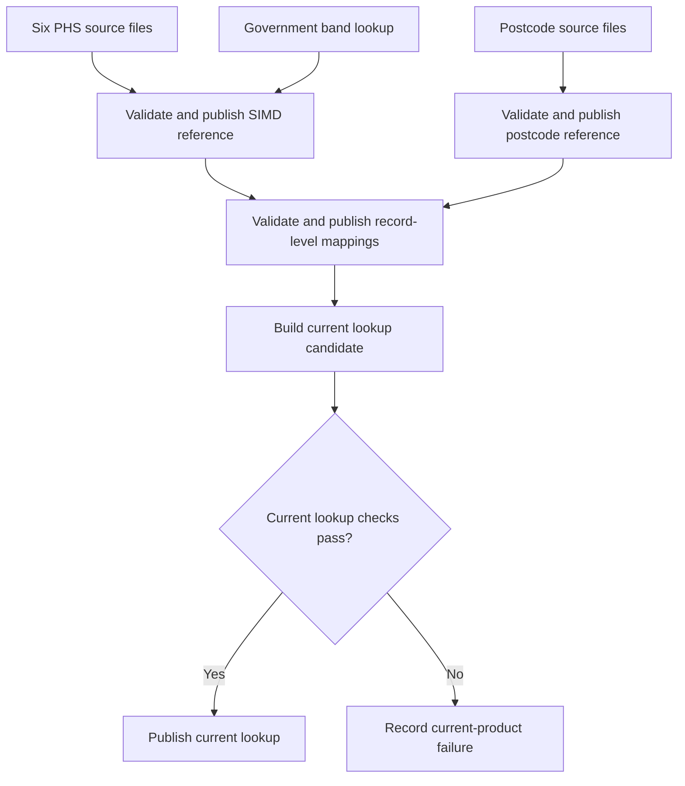

# SIMD ingestion: full implementation plan

Prepared for Michele Tinti, HIC Data Team. 9 September 2026.

Delivery architecture superseded on 10 September 2026 by [the Snakemake implementation plan](SIMD_Snakemake_Implementation_Plan.md). The current proposed delivery is a pinned-source ingestion workflow producing one combined, validated Parquet table. Dagster, independently published products and database deployment below are retained as a historical fuller-platform design, not requirements of that first delivery.

The source evidence was reconciled on 10 September 2026 following an independent audit of all 14 downloaded files. `SIMD_Plan_Gap_Closure.md` records the evidence and remaining limitations. Executable source identities and vintage-specific method settings live in `simd_ingest/sources.yaml`; fixed acceptance expectations live in `simd_ingest/acceptance_baselines.yaml`. Those audited data contracts remain authoritative; changes to either require an explained baseline review. `simd_ingest/build.py` remains the initial wide-export prototype until the replacement workflow is implemented and validated.

## 1. Delivery contract

Build one installable Python project with a command-line interface and a Dagster interface calling the same processing functions. An adopter supplies a source location and target configuration, then builds a versioned reference dataset in its own infrastructure.

The initial supported outputs are Parquet, DuckDB and SQL Server. HIC's SQL Server integration is part of the full delivery. Keep its actual connection details in local configuration. Deliver the public repository with a quick start, schema descriptions, source attribution, dependency lock, tests and a demonstration script.

| Required source | Included in the first delivery |
| --- | --- |
| PHS SIMD | 2004, 2006, 2009v2, 2012, 2016 and 2020v2; every published column |
| Scottish Government bands | Published quintile, decile and vigintile for both geography vintages; published percentile for 2011 geography. Calculated bands for both vintages, with 2001 percentile explicitly unverified against an external publication. |
| Scottish Postcode Directory | Small-user and large-user cut index files from release 2026/2; live and deleted records; all 64 small-user and 56 large-user source fields. The cut version excludes Royal Mail delivery point count, non-residential delivery point count and household count. |
| Joined reference data | Each canonical postcode record linked to all six SIMD editions using the correct data-zone vintage; a current-postcode convenience output |
| Operational evidence | Complete source manifest, validation results, publication status, record changes, and repeat-run evidence |

Release `2026_2`, its two guides, exact headers and hashes are verified. The pinned acceptance totals are 196,769 small-user and 51,004 large-user records, including 157,282 and 4,767 live records respectively. Reverify the pinned bytes on every acceptance run.

Publish four products independently. All remain in delivery scope, but failure of one product does not withdraw valid upstream products.

| Product | Required inputs | Publication boundary |
| --- | --- | --- |
| `simd_reference` | All six PHS editions, both historical government extracts, the 2011 rank-to-band workbook and the 2020v2 rank/population workbook used for validation | Canonical data-zone data and bands |
| `postcode_reference` | The selected small-user and large-user index files and their source contract | Canonical records, source links and explicit exceptions |
| `postcode_simd` | Exact published snapshots of the first two products | Mapping at postcode-record and edition grain, including unresolved records |
| `postcode_simd_current` | An exact mapping snapshot and the documented current-record resolution rules | One current record per complete NRS postcode key; ordinary-postcode searches return all candidates with an explicit selection status |

Each product records its own build result, published snapshot, parent snapshots and freshness. A failed current lookup can retain a previous successful snapshot with a stale-dependency status, or be marked never published. The overall release manifest reports partial completion when any requested product fails. It must not describe a retained older lookup as rebuilt from the latest directory release.

## 2. Source facts established during planning

The current [PHS SIMD catalogue](https://www.opendata.nhs.scot/dataset/scottish-index-of-multiple-deprivation) contains the following six resources. Direct inspection of the downloaded CSVs produced this inventory:

| Edition | Rows | Data-zone vintage | Source rank 1 | Source band 1 |
| --- | ---: | ---: | --- | --- |
| 2004 | 6,505 | 2001 | Most deprived | Least deprived |
| 2006 | 6,505 | 2001 | Most deprived | Least deprived |
| 2009v2 | 6,505 | 2001 | Most deprived | Most deprived |
| 2012 | 6,505 | 2001 | Most deprived | Most deprived |
| 2016 | 6,976 | 2011 | Most deprived | Most deprived |
| 2020v2 | 6,976 | 2011 | Most deprived | Most deprived |
| **Total** | **39,972** | | | |

All six inspected files have 16 columns: five geography identifiers, overall rank, eight population-weighted band fields, and two 15% flags. The geography headers are ordered `DataZone, IntZone, CA, HSCP, HB` for 2004-2012 and `DataZone, IntZone, HB, HSCP, CA` for 2016/2020v2; acceptance pins both exact schemas. The eight band fields are decile and quintile at Scotland, health-board, council-area and HSCP level. No blank cells were found in these pinned CSVs. Ranks form a dense permutation from 1 to the edition's row count.

**Direction correction:** preserve the rank in all six files. For 2004 and 2006, canonicalise each decile as `11 - published_decile` and each quintile as `6 - published_quintile`. Preserve the original bands alongside the canonical values. Keep the semantic Most15pc/Least15pc flags unchanged. Rank direction and band direction are separate manifest properties. Within each published geography, all eight band series were ordered consistently with these direction settings in the inspected files.

These settings were first established from the pinned resources using rank-end anchors, semantic flags and the ordering of all eight band series within their published geographies. Independent comparisons now confirm that every PHS overall rank agrees with the government rank on all six editions. Section 10 retains the original anchors, method, inspection date, source hash and documentation conflict beside each edition's settings; the companion evidence register identifies the government comparison sources.

The [government workbook](https://www.gov.scot/publications/simd-rank-to-quintile-decile-and-vigintile/) contains one sheet, `2011 Data Zones`, with 6,976 rank records and four band columns. Comparison with the integer formula below produced **zero mismatches for all four bands**:

```python
band = (rank * k + n - 1) // n  # integer equivalent of ceil(rank * k / n)
# k = 5, 10, 20 or 100
```

The source lookup is keyed by geography vintage and rank. Apply its 2011-geography mapping to 2016 and 2020v2, which both have the matching 6,976-zone rank universe.

### Historical lookup: resolved, and the formula is vintage-specific

The data.gov.scot historical SIMD extracts publish official quintile, decile and vigintile bands for 2004, 2006, 2009 and 2012 on 2001 data zones, and for 2016 on 2011 data zones. The 2001-geography bands are not reproduced by the formula above: it produces 5 decile and 10 vigintile errors per edition. A half-up cut-point rule reproduces the published overall SIMD bands exactly:

```python
band = (k * (2 * rank - 1) + 2 * n - 1) // (2 * n)   # 2001 data zones only
```

That reproduces all three published band series for all four 2001-geography editions with zero mismatches, and fails on 2011 geography where the `ceil` rule is exact. Select the method through `rank_band_methods` in `simd_ingest/sources.yaml`: `halfup_cut_2001_v1` for 2001 and `integer_ceil_rank_fraction_v1` for 2011. There is no global fallback method. Apply the selected rule to calculated percentiles too, but label the 2001 percentile `calculated_unverified`; matching quintiles, deciles and vigintiles does not establish a published historical percentile methodology. The historical adapter selects the overall `SIMD` domain and maps source date code `2009` to edition `2009v2`; domain sub-indices may contain tied fractional ranks.

## 3. Implementation structure and execution

Use Python, pandas and PyArrow for parsing, normalisation and file output; DuckDB for the local queryable result; SQLAlchemy with pyodbc for SQL Server. Dagster calls the core functions and records execution evidence. Pin supported versions in `uv.lock` during implementation. Avoid a general database framework: implement and verify the three named targets.

| Project location | Responsibility |
| --- | --- |
| `config/sources.yaml` | Resource identities, source locations, hashes, release metadata and source licences |
| `config/columns/` | Explicit source-to-canonical mappings, including every PHS and postcode field |
| `config/site.example.yaml` | Paths, offline/fetch mode, target, schema or prefix, explicit default SIMD edition |
| `src/simd_ingest/core/` | Source verification, parsing, normalisation, bands, postcode mapping, joins and validation |
| `src/simd_ingest/targets/` | Parquet, DuckDB and SQL Server writers, readback checks and publication |
| `src/simd_ingest/audit/` | Build manifest, payload hashing and record differences |
| `src/simd_ingest/cli.py` | Commands calling the same core and target functions |
| `src/simd_ingest/dagster/` | Assets, source partitions, checks and explicit publication assets |
| `tests/` | Small adversarial fixtures, pinned-source checks and target integration tests |
| `docs/` | Getting started, data dictionary, adding sources, postcode interpretation and demo script |

Retain approved small PHS files and the government workbook with the release, with their attribution. The selected postcode files live at a configured external location or in an authorised source bundle. Record their redistribution terms before distributing copies.



Partition SIMD source processing by edition and postcode processing by directory release. Each product pins its own complete required input set and configuration. Dependent products pin exact parent snapshot identifiers; they never read whichever parent happens to be current halfway through a build. Reuse unchanged intermediates, with a top-level manifest recording the compatible product versions selected for the full release.

Each Dagster publication asset depends on its product's complete candidate and required checks. Its ordinary IO-manager write callback must not be treated as a callback that resumes after separate checks. The target publication function also verifies the successful validation record for the exact immutable candidate, so the CLI enforces the same gate. A failing convenience output does not gate upstream publication assets. [Dagster asset checks](https://docs.dagster.io/guides/test/asset-checks)

## 4. Data contracts

Every published table belongs to a `dataset_snapshot_id` scoped to its product. Dependent snapshots record their parent product IDs. Separate a dataset snapshot from `run_id`: a run is an execution attempt, including failed attempts and repeat runs. A release manifest groups product versions without forcing them to publish in one transaction.

| Output | Grain and purpose |
| --- | --- |
| Original source files and raw tables | Unchanged file bytes plus parsed rows retaining original field names. Keep separate raw PHS tables/partitions because edition-specific headers differ. |
| `simd_datazone` | One row per snapshot, edition and data-zone code. All harmonised PHS fields, original values and canonical bands, government published bands where available, and calculated rank bands. |
| `govscot_rank_bands` | One row per snapshot, geography vintage and rank, preserving published quintile, decile and vigintile for both vintages, percentile for 2011 only, and links to every supporting source. The 2001 published percentile is null. |
| `postcode_index` | One row per canonical postcode record within the selected directory release, with a stable record identifier, dates, user type, split information and available geography vintages. |
| `postcode_source_records` | Source file and row references linking each canonical postcode record to its original records; also records any explicitly resolved duplicate. |
| `postcode_simd` | One row per snapshot, canonical postcode record and SIMD edition, including unresolved matches and their reason. |
| `postcode_simd_current` | One row per live complete NRS postcode key for the configured edition, initially `2020v2`. Includes an ordinary-postcode search key and candidate-selection status; an ordinary postcode is not a unique key. |
| Metadata tables | Product and release manifests, input files, execution attempts, validation results, product publication/freshness status, history and change summaries. |

### SIMD fields and band meanings

`simd_datazone` includes `edition_key`, `dz_vintage`, `dz_code`, intermediate-zone and published PHS HB/HSCP/CA codes, `rank_source`, `rank_deprivation`, both 15% flags, and all eight PHS bands.

For each PHS band, retain an `_source` field and the canonical field. Examples: `phs_country_decile_source`, `phs_country_decile`, `phs_hb_quintile_source`, `phs_hb_quintile`. Preserve any new source qualifiers through a reviewed mapping. An unknown column fails schema validation rather than being silently discarded.

Use three explicit namespaces:

- `phs_*`: the published population-weighted measures, with source and canonical forms.
- `govscot_published_*`: the four bands copied from the matching government lookup; null for editions without a matching published lookup.
- `rank_based_*`: calculated quintile, decile, vigintile and percentile for every edition. Store `rank_band_method` and `rank_band_validation_basis`.

For both geography vintages, calculated rank bands must equal each available published government band exactly, using the rule for that vintage. For 2001 geography the published bands come from the historical data.gov.scot extract; only percentile remains calculated without a published counterpart. PHS and rank-based bands answer different questions. Their expected disagreement must be preserved in acceptance tests for the pinned input versions rather than merely reported.

### Pinned divergence acceptance baselines

The following counts and all 12 fingerprints were independently reproduced on 10 September 2026 by comparing canonical PHS country bands with published government bands. The historical extracts supply 2004-2016 bands by data zone; the published 2011 rank lookup supplies 2020v2 bands by rank. Calculated bands are checked separately using the configured method for each vintage.

| Edition | Zones | Quintile mismatches | Decile mismatches | Maximum absolute difference for either band |
| --- | ---: | ---: | ---: | ---: |
| 2004 | 6,505 | 71 | 173 | 1 |
| 2006 | 6,505 | 131 | 276 | 1 |
| 2009v2 | 6,505 | 231 | 468 | 1 |
| 2012 | 6,505 | 292 | 589 | 1 |
| 2016 | 6,976 | 190 | 395 | 1 |
| 2020v2 | 6,976 | 231 | 481 | 1 |

For 2020v2 these are 3.311353% at quintile and 6.895069% at decile, agreeing with the rounded 3.3% and 6.9% measurements. Assert exact integer counts for these hashes, plus the expected maximum difference and a fingerprint of the affected data-zone/value triples. Counts alone could pass with the wrong zones. Section 10 stores the fingerprints and their encoding rule.

A new source hash or changed method needs a reviewed baseline change with an explanation. Do not impose today's percentages on every future publication, and do not regenerate expected results automatically during the acceptance test. Preserve these as fixed regression expectations tied to the input hashes and method.

Preserve PHS geography codes as published and record their metadata vintage. Keep postcode-release geography fields distinct. Neither source's administrative geography is automatically the geography contemporaneous with an older SIMD edition.

### Postcode rules

The pinned cut files contain ASCII text, 64/56 source columns, blank deletion dates for live records, day-precision dates and complete data-zone mappings for 2001, 2011 and 2022. The key `(pc_norm, DateOfIntroduction, DateOfDeletion)` is unique across both files; there are no identical duplicate rows. The acceptance command verifies the exact headers, keys, dates, sentinels and counts. A later release requires fresh profiling before its contract is accepted.

Preserve all original columns and rows. Define `pc_norm` as the complete NRS postcode, uppercased with ASCII spaces removed, retaining any NRS suffix. Retain the original text. Define `pc_base` separately for ordinary-postcode searches: remove a validated trailing A/B/C suffix only from a small-user postcode flagged as split and matching the source postcode structure. Never infer a suffix from total length alone. All 1,263 small-user split records have a suffix, including 669 keys shorter than eight characters. The 28 large-user split flags describe the linked small-user postcode; large-user keys are not shortened. Use identical normalisation and parsing in joins and consumer examples; explicitly flag malformed characters and other whitespace.

Keep every distinct postcode-period-geography record. Assign a deterministic `postcode_record_id` from the documented canonical identity within the pinned release; keep source file/row references separately. Merge identical canonical records only with retained provenance. Never deduplicate on postcode alone. A small-user preference is valid only for the exact conflict type justified by the source documentation, and must be reported.

Preserve introduction/deletion values, nulls and precision. Do not fabricate dates for unknown values. Do not equate postcode lifetime with the validity interval of every attached geography. Publish the result as a lookup from a specified directory release. A precise historical lookup is only supported where the source's date and geography semantics establish it.

For date filtering use `[introduction, deletion)`, with a null deletion treated as open-ended. The release has 818 pairs where one record's deletion equals another's introduction for the same complete NRS key: 479 small-to-small, 12 large-to-large, 72 small-to-large and 255 large-to-small. Eight are the documented 18 February 2026 split corrections. There are no strictly overlapping positive-duration intervals. Preserve the 28 records with equal introduction and deletion dates (27 small-user, one large-user), flag `same_day_introduction_deletion`, and retain them in the canonical index and all-edition bridge. They have no representable duration under this day-precision half-open convention and do not match an as-of date. Do not fabricate an extra day or reject these rows as invalid; dates with deletion before introduction do fail validation.

Preserve `LinkedSmallUserPostcode` as published. Classify 31,725 `NO LINKP` and six `NO LINK` values as separate sentinel reasons. The remaining 19,273 real links all resolve to a small-user postcode key in this release. This proves postcode-key existence, not selection of a unique historical small-user record; a record-level link must resolve periods separately and must not fan out silently.

The selected source must supply 2001 and 2011 data-zone mappings to support all six editions. Retain 2022 mappings when supplied. If a required mapping is absent, investigate an official supplementary lookup and record it as another pinned source. Do not substitute a different geography vintage.

For the current convenience output, require one live record per complete NRS key. This holds for all 162,049 live records in the pinned release. Duplicate live records for a complete NRS key block this product's candidate only; other validated products may publish independently.

Ordinary-postcode searches use `pc_base` and return every candidate with a candidate count and `selection_status` (`unique`, `ambiguous` or `not_found`). Expected split ambiguity does not invalidate the complete-NRS-key current table. There are 161,822 distinct live ordinary postcodes; 226 have multiple candidates (225 pairs and one triple), and 203 have differing 2011 data zones and 2020v2 ranks. Keep even same-zone candidates distinct. For example, `AB123GQ` returns `AB123GQA` (rank 5484) and `AB123GQB` (rank 5522). Do not silently choose A, collapse candidates, or present one ordinary-postcode SIMD value where selection remains ambiguous.

### SQL Server postcode-key contract

Use `VARCHAR(8)` for the normalised ASCII postcode key, with a literal column collation emitted at DDL creation time. Preserve source text separately as Unicode where needed. Validate characters and length before conversion; never silently truncate or replace characters. Use the same key type, length and collation in the postcode index, bridges, convenience tables and temporary join tables.

Example HIC profile, carrying forward the proposed collation from the original design:

```sql
pc_norm VARCHAR(8) COLLATE Latin1_General_CI_AS NOT NULL
```

`Latin1_General_CI_AS` is an explicit proposed HIC setting, not a verified description of the existing server and not a universal default for adopters. Confirm the site's established lookup/join collation and record the selected literal in target configuration. The adapter checks it against available SQL Server collations, emits it explicitly in every postcode-key column definition and verifies `sys.columns` after deployment. Database and tempdb defaults must not silently determine the contract. [Microsoft COLLATE documentation](https://learn.microsoft.com/en-us/sql/t-sql/statements/collations)

Define an index appropriate to snapshot and postcode lookup, and retain record identifiers in historical keys. Verify representative parameterised lookups and joins for collation conflicts and implicit conversion on the indexed key. Where a consumer uses a different type or collation, document creating a compatible normalised key on that side; do not routinely wrap the reference index key in a conversion. Person-level linkage code remains external, but this public join contract is part of the reference product.

### Join and coverage contract

For every canonical postcode record, create six edition candidates. Choose `dz2001` for 2004-2012 and `dz2011` for 2016/2020v2, then left-join to the unique SIMD edition/data-zone key.

Retain unmatched rows with `match_status`, such as `matched`, `missing_datazone` or `unknown_datazone`. This gives an exact bridge cardinality check: `canonical_postcode_records * 6`. Process and write one edition at a time to avoid materialising a large, wide bridge in memory.

Report match counts by edition, postcode user type and live/deleted status. Report SIMD zones without mapped postcodes separately. Reconcile all unmatched cases to the source inventory; unexplained changes from an accepted release require investigation. A source-documented absence is distinguishable from a failed join.

The current output selects live postcodes and the explicit configured edition. It keeps unmatched postcodes with null SIMD values and a reason. User-facing examples select the SIMD edition explicitly; publication dates are metadata, not a built-in rule for assigning an edition to a patient's event date.

## 5. Validation and publication

| Area | Required checks |
| --- | --- |
| Inputs | Every resource required by the selected product is present; SHA256 matches; resource/schema identity matches; no unhandled column; source and configuration manifests complete. |
| PHS editions | Exact pinned row count; unique data-zone key; expected vintage; dense ranks; band ranges; unchanged source values; separate rank/band direction checks. |
| PHS bands | Monotone canonical bands within the appropriate published geography; semantic flags agree with rank ends. For 2020v2, reconstruct country decile, quintile and both 15% flags with zero differences using the official 2017 population estimates in the rank workbook and the population-midpoint rule. At HB, HSCP and CA level assert the exact published/calculated exception tuples: S01012409 has decile 2/3 and quintile 1/2; S01012387 has decile 4/5 and quintile 2/3. These are two zones and 12 differing cells; cause unresolved, not an established boundary tie-break. Preserve the published values. |
| Government bands | 6,976 unique ranks for 2011 geography, valid ranges, complete join and zero differences for all four published bands. For 2001 geography require 6,505 unique overall SIMD ranks and zero differences against the configured half-up rule for quintile, decile and vigintile on all four early editions. |
| Rank direction | The overall SIMD rank in each PHS file is identical, row for row, to the official government rank on all six editions. |
| Earlier calculated bands | Exact integer arithmetic; allowed ranges; complete ranks; band sizes differ by at most one; boundary fixtures. The limited-validation label now applies only to 2001-geography percentile. |
| PHS/rank divergence | Exact per-edition mismatch counts, maximum differences and affected-record fingerprints from the pinned baseline; changed inputs or methods require reviewed baseline changes. |
| Postcode reference | Exact 64/56-column source schemas, published record/live/deleted totals, record-key uniqueness and no discarded distinct row. Parse `D/M/YYYY` dates at day precision. Require 818 touching pairs with the four user-type transition counts above, eight named February corrections, 28 retained and flagged same-day records, and zero strict overlaps or negative intervals. Require both link sentinel counts and 19,273 real links with zero unresolved postcode keys. |
| Current lookup | 162,049 unique live complete NRS keys. Ordinary-postcode searches retain all candidates: 161,822 base keys, 226 with multiple records and 203 with differing 2011 zones/ranks. Never substitute a first-match selection. Duplicate complete live NRS keys gate this product only. |
| Bridge | Six candidates per canonical postcode record, 1,486,638 rows for this release; many-to-one SIMD joins; no fan-out; every miss classified; expected geography vintage used. Data-zone coverage is complete in both directions for release 2026/2, so assert zero unmatched. Cross-check the directory's own SIMD 2020 rank column against the PHS 2020v2 rank through `DataZone2011Code`. |
| Publication | Candidate and validation fingerprints agree; target readback values/types/keys/collation match the product bundle; required tables belong to one product snapshot with explicit parent versions. |
| Recovery | Failed checks or interrupted loads leave the previous active product snapshot available; rollback restores the entire selected product snapshot. |

Keep quality rules as ordinary Python functions returning structured results. Dagster exposes those results as checks; the CLI uses them too. A missing required source fails the affected product and dependent candidates. Other complete products can publish. A request to build all products returns a non-success overall result if any requested product fails and records exactly which products published; it does not undo valid independent publications or claim a complete release.

Run `python simd_ingest/acceptance.py` from the project root to verify the downloaded source contracts; `--json` emits structured evidence and failure exits are nonzero. This command reads all pinned sources without building or publishing outputs. It validates the source-derived bridge cardinality and coverage, not a stored bridge or target deployment. Full delivery still requires the product, readback and recovery checks below.

For Parquet, write an immutable directory per product snapshot with tables, schemas, manifest and validation report. Finalise the product manifest only after its checks succeed. On a local filesystem, change that product's active-pointer file by an atomic replacement on the same filesystem. The top-level release manifest records product statuses and parent versions.

For SQL Server and DuckDB, use stable tables carrying a snapshot identifier. Load the new product snapshot into an inactive area, validate stored values, then update its active-snapshot record in a transaction. Stable consumer views filter by the relevant product pointer. This preserves table identities, indexes and permissions and avoids repeated table renaming. Provide snapshot-specific queries for analyses spanning several queries. Dependent products and multi-query analyses pin explicit parent snapshot identifiers.

The initial supported mode has one publisher per target. Enforce this in the shared execution layer for the publishing run, including CLI execution, using a target-appropriate exclusive lock. A second publisher fails cleanly rather than competing. Keep transactional pointer updates and rollback to a previous validated product snapshot. Defer concurrent-publisher compare-and-swap coordination until concurrent publishing is a requirement. File and database destinations have separate publication outcomes; do not imply a distributed transaction across them. Rolling back one parent product does not silently rebuild or relabel dependent products; their pinned dependencies and freshness remain explicit.

Record package/build version, code fingerprint including shared helpers, configuration hash, dependency-lock hash and every source hash. Git SHA is useful when available; installed packages must work without a `.git` directory. Required build identity must still be available from release metadata.

Hash payload rows in a deterministic order with explicit handling of nulls, strings, numbers and dates. Exclude snapshot IDs, execution IDs and load timestamps from data-change comparisons. Produce inserted/updated/deleted/unchanged counts and bounded examples of changed keys and values. Distinguish a new build with unchanged values from a changed dataset.

## 6. Configuration and adoption

Maintain one sources manifest, one schema/mapping definition per source format and one local site configuration. Reject contradictory settings, including supplying both a literal connection URL and a URL environment-variable setting. Do not use import-time network access or database connections.

Proposed site settings:

```yaml
mode: offline
source_manifest: config/sources.yaml
source_dir: data/sources
postcode_release: '2026_2'
default_simd_edition: '2020v2'
target:
  type: sqlserver
  url_env: SIMD_TARGET_URL
  schemas: {raw: simd_raw, data: simd, meta: simd_meta}
  object_prefix: ''
  postcode_key_type: 'varchar(8)'
  postcode_key_collation: Latin1_General_CI_AS  # proposed HIC value; verify local join contract
publication:
  mode: single_publisher
```

Parquet and DuckDB examples use the same source manifest and processing rules. Support a schema prefix when a site uses a shared schema. Implement the target-specific type mappings, authentication and publication behaviour explicitly. Verify Windows integrated authentication for HIC's native Windows execution profile; verify other authentication environments separately.

Proposed commands, to be implemented:

```bash
simd fetch --manifest config/sources.yaml --source-dir data/sources
simd run --site config/site.local.yaml
simd run --site config/site.local.yaml --product simd_reference
simd validate --bundle out/releases/SNAPSHOT_ID
simd load --bundle out/releases/SNAPSHOT_ID --site config/site.local.yaml
simd report --run RUN_ID
simd rollback --site config/site.local.yaml --product PRODUCT --snapshot SNAPSHOT_ID
```

`fetch` downloads the exact pinned sources; changed bytes fail verification. A separate source-maintenance workflow reviews new source versions and commits the updated manifest. Offline runs use locally supplied files and preinstalled pinned dependencies. Document how to prepare both the source bundle and the dependency environment before entering the safe haven.

Adding an edition following an existing supported format uses a manifest entry and column map. Changed methods, file structures or geography semantics can require a new versioned adapter and tests.

## 7. Accelerated build order

All three required data families are part of the first full release. Keep implementation work focused on the data path, publication and demonstrable evidence.

| Block | Concrete work | Exit condition |
| --- | --- | --- |
| 1. Lock inputs and contracts | Source access and profiling are complete. Maintain the pinned manifest, exact schemas, vintage-specific methods and reviewed exception baselines; run source acceptance before building. | All 14 files and the corrected source contracts pass the reproducible acceptance command. |
| 2. Build SIMD and band outputs | Ingest every PHS field for all six editions. Apply the corrected directions. Parse government bands and calculate all four rank bands. | 39,972 canonical SIMD rows; exact source-field reconciliation; zero government-lookup mismatches. |
| 3. Build postcode outputs | Preserve both source indices. Canonicalise records and source links, resolve documented collisions and retain all geography vintages. | Raw/canonical reconciliation closes; record keys are unique; ambiguity and exceptions are explicit. |
| 4. Join and export | Build six-edition record mappings and a separately validated current lookup. Export Parquet and load DuckDB. | Cardinalities, coverage and stored values pass per product; current-product ambiguity does not prevent upstream publication. |
| 5. Publish and integrate | Implement snapshot publication, rollback, manifests and diffs. Load the full bundle into HIC SQL Server and reconcile readback. | Identical input rerun has zero payload changes; failed candidate preserves active data; SQL Server values agree with the bundle. |
| 6. Demonstrate and package | Expose the same functions through Dagster and the CLI. Add quick start, data dictionary, source licences and CI. Rehearse the full demonstration. | A colleague can reproduce the full result; the demo shows all sources, coverage, provenance, controlled changes and a blocked bad candidate. |

All required data files and source guides are available. Remaining work is implementation and target integration, with HIC access needed for its deployment checks. Establish product-level validation/publication interfaces early so the final integration does not require restructuring the pipeline. The existing wide Parquet slice and source acceptance command are useful starting points, not completion of these delivery blocks.

Use full small PHS resources and the government lookup in source acceptance tests. Use targeted postcode fixtures for recycled codes, identical duplicates, conflicting live records, source-specific date precision, missing vintages and unmatched joins. Run the full selected postcode release as an acceptance run. CI must also exercise failed publication, reruns and per-target readback; passing DataFrame tests alone does not establish correct database loading.

### Effort and assumptions

The modest row count makes transformation and loading manageable. Most delivery effort is in interpreting the source contracts, preserving evidence, publishing validated results, recovering from failure and verifying adoption in a second environment. Those capabilities are the proposed value of the RDMP replacement and must be budgeted explicitly.

Planning estimate for one experienced Python/SQL Server engineer, with coding assistance, starting from the source profiling already completed:

| Work | Estimated engineering days |
| --- | ---: |
| Source adapters, full SIMD normalisation and band mappings | 1-2 |
| Postcode contract, canonical index and all-edition joins | 1-2 |
| Evidence records, regression baselines, manifests, CLI and Dagster integration | 1.5-2.5 |
| Three target writers, single-publisher control, readback, publication and rollback | 2-3 |
| Integration tests, packaging, documentation and demonstration | 1.5-2.5 |
| **Full specified delivery** | **7-12** |

These are effort estimates, not calendar commitments. They assume source files and guides are available, SQL Server access works, and the environment supports the selected dependencies. Source ambiguity, access delays or deployment restrictions add elapsed time. A first walkthrough exercising all three data families may be achievable around engineering day 4-6 within this total; it is not completion of the publication and recovery gates. Concurrent publishers and a generic multi-database framework are outside this estimate.

## 8. Demonstration and completion

The demonstration opens the Dagster graph showing six PHS editions, both government extracts, both workbooks and both postcode indices with their guides. Show the complete dataset manifest, 39,972 SIMD records, measured postcode counts and coverage by edition. Trace one postcode result through its data-zone vintage, source rank, PHS band, government/calculated band and source files. Show an ordinary-postcode search with multiple NRS candidates and its explicit ambiguity status.

Then run identical inputs and show zero payload changes. Introduce a duplicate key in a clearly labelled test fixture and show that the affected product's publication is blocked while its active snapshot remains queryable. Separately demonstrate an ambiguous current-postcode candidate: the current product fails or retains an older snapshot with an explicit status, while validated SIMD reference and record-level mappings remain available. Run a valid synthetic revision and show exactly which values changed. Finish with the same product versions queried in DuckDB and HIC SQL Server, and the command-line entry point another safe haven would use.

Completion requires all six editions, every PHS field, all four government band columns, both postcode files, the all-edition bridge, a separately governed current output, auditable product publication, recovery tests and demonstrated SQL Server loading. Delivery includes a functioning current-output path; an individual candidate can fail its checks without withholding validated products. The demonstration and release manifest must show any remaining failure or stale product plainly. Source profiling performed for this plan does not itself satisfy those implementation gates.

## 9. Inputs still needed for implementation

1. **HIC target details at deployment time:** reachable SQL Server database, intended authentication and available schema/table permissions. Keep credentials outside the repository.
2. **Postcode redistribution terms before distributing source copies:** retain attribution and confirm the terms applying to the cut index. Local ingestion does not require bundling it in the public repository.

All required downloaded data and guides are in hand and hash-pinned. Defaults are all six PHS editions, verified postcode release `2026_2`, `2020v2` for the current convenience output, explicit edition selection for analytical queries and independent product publication. The unverified 2001 percentile methodology and unexplained Shetland sub-geography reconstruction differences remain labelled limitations, not missing source files.

## 10. Verified source register

The following register records the exact files inspected for this plan. Hashes pin content; they are not evidence that a source's meaning or every downstream transformation is correct. Source URLs and CKAN identifiers are retained so updates can be reviewed against the original resource.

```yaml
inspected_on: 2026-09-09
phs_catalogue: https://www.opendata.nhs.scot/dataset/scottish-index-of-multiple-deprivation
direction_documentation_evidence:
  id: phs_concepts_20260909
  observed_on: 2026-09-09
  page: https://www.opendata.nhs.scot/dataset/scottish-index-of-multiple-deprivation
  metadata_endpoint: "https://www.opendata.nhs.scot/api/3/action/package_show?id=scottish-index-of-multiple-deprivation"
  metadata_field: result.nhs_concepts
  downloaded_metadata_response_sha256: "2f6bb9f75afb577c2c37ff538ddbf6cb3c8ef0325f9bff54426f12888b1daa64"
  captured_assertion: "The level of deprivation in all categories for SIMD 2004 and SIMD 2006 is increasing (1 = least deprived). From SIMD 2009 onwards, the level of deprivation is decreasing (1 = most deprived)."
  assertion_utf8_sha256: "31351cfba71b60654cf447d774502735ffff1a4bfbb3db3169295e67e6987a4b"
  scope_note: "The broad all-categories statement contradicts the observed rank direction for 2004/2006; it agrees with their band direction."
regression_baseline_policy:
  method_config: simd_ingest/sources.yaml#rank_band_methods
  method_selection: dz_vintage
  phs_comparison_scope: country
  applies_to: exact_pinned_source_hashes_and_method
  changed_source_or_method: review_baseline_change_with_explanation
  mismatch_fingerprint_encoding: "Sort differing (DataZone, canonical_PHS_band, published_government_band) triples by DataZone. Encode each as DataZone|PHS|government_band with integers in decimal. Join records with LF, no trailing LF, encode UTF-8, then SHA256."
historical_government_lookup_search:
  resolved_on: 2026-09-09
  geography_vintage: 2001
  rank_universe: 6505
  status: resolved
  source: govscot_hist_2004_2012   # see SIMD_Plan_Gap_Closure.md section 8
  bands_published: [quintile, decile, vigintile]
  percentile_published: false
  verified_band_rule: "(k * (2 * rank - 1) + 2 * n - 1) // (2 * n)"
  verified_band_rule_mismatches: 0
phs_sources:
  - edition: "2004"
    resource_id: "a97fca71-ebbb-4897-a611-88024a76ff21"
    file: "simd2004_02042020.csv"
    url: "https://www.opendata.nhs.scot/dataset/78d41fa9-1a62-4f7b-9edb-3e8522a93378/resource/a97fca71-ebbb-4897-a611-88024a76ff21/download/simd2004_02042020.csv"
    sha256: "dcc871e88353884a166c09ab406fa798d2e8f0ba58000db55066ba6723bda45f"
    expected_rows: 6505
    expected_columns: 16
    dz_vintage: 2001
    source_field_prefix: "SIMD2004"
    rank_direction: most_deprived_is_1
    phs_band_direction: least_deprived_is_1
    direction_evidence:
      id: "phs_2004_directions_20260909"
      observed_on: 2026-09-09
      established_by: "Automated inspection in this planning conversation"
      classification: empirical_within_resource_and_government_rank_reconciliation
      source_sha256: "dcc871e88353884a166c09ab406fa798d2e8f0ba58000db55066ba6723bda45f"
      rank_basis: "Semantic Most15pc and Least15pc flags on the lowest- and highest-rank rows."
      band_basis: "Country bands at the anchored rank ends, supported by ordering of all eight band series within their published geographies."
      low_rank_anchor: {"data_zone": "S01003379", "rank_source": 1, "country_decile_source": 10, "country_quintile_source": 5, "most15pc": 1, "least15pc": 0}
      high_rank_anchor: {"data_zone": "S01001754", "rank_source": 6505, "country_decile_source": 1, "country_quintile_source": 1, "most15pc": 0, "least15pc": 1}
      checked_scopes: [country, health_board, council_area, hscp]
      band_ordering_violations: 0
      documentation_evidence_id: phs_concepts_20260909
      documentation_conflicts_with_rank: true
      documentation_conflicts_with_bands: false
      independent_original_government_rank_comparison: performed_identical   # vs official gov.scot ranks
    divergence_baseline:
      denominator: 6505
      quintile:
        mismatch_count: 71
        maximum_absolute_difference: 1
        mismatched_values_sha256: "72e0e7dd54809c3237a185c9cf45291737c890dcb3e5ed7bcdf93eec86a43f26"
      decile:
        mismatch_count: 173
        maximum_absolute_difference: 1
        mismatched_values_sha256: "bae0a5bcaa7872b5f63aa86123369b61be2607317756b7e495cb7bde184dd71e"
        basis: published_govscot_band   # corrected; earlier value used the wrong vintage rule
    licence_reference: https://www.opendata.nhs.scot/dataset/scottish-index-of-multiple-deprivation
  - edition: "2006"
    resource_id: "6f871d03-d2af-4fe2-a615-d2d2ca76c3a5"
    file: "simd2006_02042020.csv"
    url: "https://www.opendata.nhs.scot/dataset/78d41fa9-1a62-4f7b-9edb-3e8522a93378/resource/6f871d03-d2af-4fe2-a615-d2d2ca76c3a5/download/simd2006_02042020.csv"
    sha256: "69f9fb1a2e51d464366497c51f68aaaf80a23774f96daa5c492dc1db1aa8c578"
    expected_rows: 6505
    expected_columns: 16
    dz_vintage: 2001
    source_field_prefix: "SIMD2006"
    rank_direction: most_deprived_is_1
    phs_band_direction: least_deprived_is_1
    direction_evidence:
      id: "phs_2006_directions_20260909"
      observed_on: 2026-09-09
      established_by: "Automated inspection in this planning conversation"
      classification: empirical_within_resource_and_government_rank_reconciliation
      source_sha256: "69f9fb1a2e51d464366497c51f68aaaf80a23774f96daa5c492dc1db1aa8c578"
      rank_basis: "Semantic Most15pc and Least15pc flags on the lowest- and highest-rank rows."
      band_basis: "Country bands at the anchored rank ends, supported by ordering of all eight band series within their published geographies."
      low_rank_anchor: {"data_zone": "S01005247", "rank_source": 1, "country_decile_source": 10, "country_quintile_source": 5, "most15pc": 1, "least15pc": 0}
      high_rank_anchor: {"data_zone": "S01002158", "rank_source": 6505, "country_decile_source": 1, "country_quintile_source": 1, "most15pc": 0, "least15pc": 1}
      checked_scopes: [country, health_board, council_area, hscp]
      band_ordering_violations: 0
      documentation_evidence_id: phs_concepts_20260909
      documentation_conflicts_with_rank: true
      documentation_conflicts_with_bands: false
      independent_original_government_rank_comparison: performed_identical   # vs official gov.scot ranks
    divergence_baseline:
      denominator: 6505
      quintile:
        mismatch_count: 131
        maximum_absolute_difference: 1
        mismatched_values_sha256: "89b76f1b9adc202d74ef7996e302b62b73add972dc9f5bfea99ee202442f05d1"
      decile:
        mismatch_count: 276
        maximum_absolute_difference: 1
        mismatched_values_sha256: "8113af887dc16b5e9955ba5349535d6744ee613bf367c536ad0c56c892ff94d9"
        basis: published_govscot_band   # corrected; earlier value used the wrong vintage rule
    licence_reference: https://www.opendata.nhs.scot/dataset/scottish-index-of-multiple-deprivation
  - edition: "2009v2"
    resource_id: "d9738550-4cf9-428e-8453-c2aad463ff68"
    file: "simd2009v2_23062019.csv"
    url: "https://www.opendata.nhs.scot/dataset/78d41fa9-1a62-4f7b-9edb-3e8522a93378/resource/d9738550-4cf9-428e-8453-c2aad463ff68/download/simd2009v2_23062019.csv"
    sha256: "effa76a989820f28a470cd3af4fc1268b7ac5313bb4d394c06e913e0b782bbb9"
    expected_rows: 6505
    expected_columns: 16
    dz_vintage: 2001
    source_field_prefix: "SIMD2009V2"
    rank_direction: most_deprived_is_1
    phs_band_direction: most_deprived_is_1
    direction_evidence:
      id: "phs_2009v2_directions_20260909"
      observed_on: 2026-09-09
      established_by: "Automated inspection in this planning conversation"
      classification: empirical_within_resource_and_government_rank_reconciliation
      source_sha256: "effa76a989820f28a470cd3af4fc1268b7ac5313bb4d394c06e913e0b782bbb9"
      rank_basis: "Semantic Most15pc and Least15pc flags on the lowest- and highest-rank rows."
      band_basis: "Country bands at the anchored rank ends, supported by ordering of all eight band series within their published geographies."
      low_rank_anchor: {"data_zone": "S01003279", "rank_source": 1, "country_decile_source": 1, "country_quintile_source": 1, "most15pc": 1, "least15pc": 0}
      high_rank_anchor: {"data_zone": "S01000318", "rank_source": 6505, "country_decile_source": 10, "country_quintile_source": 5, "most15pc": 0, "least15pc": 1}
      checked_scopes: [country, health_board, council_area, hscp]
      band_ordering_violations: 0
      documentation_evidence_id: phs_concepts_20260909
      documentation_conflicts_with_rank: false
      documentation_conflicts_with_bands: false
      independent_original_government_rank_comparison: performed_identical   # vs official gov.scot ranks
    divergence_baseline:
      denominator: 6505
      quintile:
        mismatch_count: 231
        maximum_absolute_difference: 1
        mismatched_values_sha256: "94dbdfd75ea0189d45b0df18d6e591dd91b49cc55189905fd925e0d5aa310fe1"
      decile:
        mismatch_count: 468
        maximum_absolute_difference: 1
        mismatched_values_sha256: "ee002c41013c0578f99b2783685c4edceb7bad0bc3219ad94e3c94c9d6908e9a"
        basis: published_govscot_band   # corrected; earlier value used the wrong vintage rule
    licence_reference: https://www.opendata.nhs.scot/dataset/scottish-index-of-multiple-deprivation
  - edition: "2012"
    resource_id: "dd4b13d3-066b-4714-bb1f-730e1a1ee692"
    file: "simd2012_02042020.csv"
    url: "https://www.opendata.nhs.scot/dataset/78d41fa9-1a62-4f7b-9edb-3e8522a93378/resource/dd4b13d3-066b-4714-bb1f-730e1a1ee692/download/simd2012_02042020.csv"
    sha256: "c4c12b6346ee9fa14383e41eaccf6d479df0c745f3fafc753b035d3600a897d3"
    expected_rows: 6505
    expected_columns: 16
    dz_vintage: 2001
    source_field_prefix: "SIMD2012"
    rank_direction: most_deprived_is_1
    phs_band_direction: most_deprived_is_1
    direction_evidence:
      id: "phs_2012_directions_20260909"
      observed_on: 2026-09-09
      established_by: "Automated inspection in this planning conversation"
      classification: empirical_within_resource_and_government_rank_reconciliation
      source_sha256: "c4c12b6346ee9fa14383e41eaccf6d479df0c745f3fafc753b035d3600a897d3"
      rank_basis: "Semantic Most15pc and Least15pc flags on the lowest- and highest-rank rows."
      band_basis: "Country bands at the anchored rank ends, supported by ordering of all eight band series within their published geographies."
      low_rank_anchor: {"data_zone": "S01005247", "rank_source": 1, "country_decile_source": 1, "country_quintile_source": 1, "most15pc": 1, "least15pc": 0}
      high_rank_anchor: {"data_zone": "S01001929", "rank_source": 6505, "country_decile_source": 10, "country_quintile_source": 5, "most15pc": 0, "least15pc": 1}
      checked_scopes: [country, health_board, council_area, hscp]
      band_ordering_violations: 0
      documentation_evidence_id: phs_concepts_20260909
      documentation_conflicts_with_rank: false
      documentation_conflicts_with_bands: false
      independent_original_government_rank_comparison: performed_identical   # vs official gov.scot ranks
    divergence_baseline:
      denominator: 6505
      quintile:
        mismatch_count: 292
        maximum_absolute_difference: 1
        mismatched_values_sha256: "d22f47be2fd493ff476599c0abab931a6657a41100ad2833811fca9ca6902f21"
      decile:
        mismatch_count: 589
        maximum_absolute_difference: 1
        mismatched_values_sha256: "921e7a6dcf68858659ae94a50831e35a11855e7da1e9e16a115fb171d07fb3ec"
        basis: published_govscot_band   # corrected; earlier value used the wrong vintage rule
    licence_reference: https://www.opendata.nhs.scot/dataset/scottish-index-of-multiple-deprivation
  - edition: "2016"
    resource_id: "cadf715a-c365-4dcf-a6e0-acd7e3af21ec"
    file: "simd2016_18052020.csv"
    url: "https://www.opendata.nhs.scot/dataset/78d41fa9-1a62-4f7b-9edb-3e8522a93378/resource/cadf715a-c365-4dcf-a6e0-acd7e3af21ec/download/simd2016_18052020.csv"
    sha256: "3a98af3b181d8273eca18587663175ca28d18f338d3003be620798001aeca3a6"
    expected_rows: 6976
    expected_columns: 16
    dz_vintage: 2011
    source_field_prefix: "SIMD2016"
    rank_direction: most_deprived_is_1
    phs_band_direction: most_deprived_is_1
    direction_evidence:
      id: "phs_2016_directions_20260909"
      observed_on: 2026-09-09
      established_by: "Automated inspection in this planning conversation"
      classification: empirical_within_resource_and_government_rank_reconciliation
      source_sha256: "3a98af3b181d8273eca18587663175ca28d18f338d3003be620798001aeca3a6"
      rank_basis: "Semantic Most15pc and Least15pc flags on the lowest- and highest-rank rows."
      band_basis: "Country bands at the anchored rank ends, supported by ordering of all eight band series within their published geographies."
      low_rank_anchor: {"data_zone": "S01012068", "rank_source": 1, "country_decile_source": 1, "country_quintile_source": 1, "most15pc": 1, "least15pc": 0}
      high_rank_anchor: {"data_zone": "S01008405", "rank_source": 6976, "country_decile_source": 10, "country_quintile_source": 5, "most15pc": 0, "least15pc": 1}
      checked_scopes: [country, health_board, council_area, hscp]
      band_ordering_violations: 0
      documentation_evidence_id: phs_concepts_20260909
      documentation_conflicts_with_rank: false
      documentation_conflicts_with_bands: false
      independent_original_government_rank_comparison: performed_identical   # vs official gov.scot ranks
    divergence_baseline:
      denominator: 6976
      quintile:
        mismatch_count: 190
        maximum_absolute_difference: 1
        mismatched_values_sha256: "65f8d692297c47f9ceff53227eda3a3a7c7bc32a11b592195ea1a64d89f9ea51"
      decile:
        mismatch_count: 395
        maximum_absolute_difference: 1
        mismatched_values_sha256: "c59dab4d589541870da045623b4f48624b10772eb0dc3ede86723684709920fd"
    licence_reference: https://www.opendata.nhs.scot/dataset/scottish-index-of-multiple-deprivation
  - edition: "2020v2"
    resource_id: "acade396-8430-4b34-895a-b3e757fa346e"
    file: "simd2020v2_22062020.csv"
    url: "https://www.opendata.nhs.scot/dataset/78d41fa9-1a62-4f7b-9edb-3e8522a93378/resource/acade396-8430-4b34-895a-b3e757fa346e/download/simd2020v2_22062020.csv"
    sha256: "686bc9aa38b61891f701e10d8a3970397c7be7f3819798dc43584ae42cb3a391"
    expected_rows: 6976
    expected_columns: 16
    dz_vintage: 2011
    source_field_prefix: "SIMD2020V2"
    rank_direction: most_deprived_is_1
    phs_band_direction: most_deprived_is_1
    direction_evidence:
      id: "phs_2020v2_directions_20260909"
      observed_on: 2026-09-09
      established_by: "Automated inspection in this planning conversation"
      classification: empirical_within_resource_and_government_rank_reconciliation
      source_sha256: "686bc9aa38b61891f701e10d8a3970397c7be7f3819798dc43584ae42cb3a391"
      rank_basis: "Semantic Most15pc and Least15pc flags on the lowest- and highest-rank rows."
      band_basis: "Country bands at the anchored rank ends, supported by ordering of all eight band series within their published geographies."
      low_rank_anchor: {"data_zone": "S01010891", "rank_source": 1, "country_decile_source": 1, "country_quintile_source": 1, "most15pc": 1, "least15pc": 0}
      high_rank_anchor: {"data_zone": "S01008861", "rank_source": 6976, "country_decile_source": 10, "country_quintile_source": 5, "most15pc": 0, "least15pc": 1}
      checked_scopes: [country, health_board, council_area, hscp]
      band_ordering_violations: 0
      documentation_evidence_id: phs_concepts_20260909
      documentation_conflicts_with_rank: false
      documentation_conflicts_with_bands: false
      independent_original_government_rank_comparison: performed_identical   # vs official gov.scot ranks
    divergence_baseline:
      denominator: 6976
      quintile:
        mismatch_count: 231
        maximum_absolute_difference: 1
        mismatched_values_sha256: "2b3f1249e2ff590e6a9649ca8bf17910e4c92578b5f660eeda8a6541be878b6c"
      decile:
        mismatch_count: 481
        maximum_absolute_difference: 1
        mismatched_values_sha256: "b807713f26b511a54fea3fb2f0cb2332e8996f2540163e03f55aba4a1041e750"
    licence_reference: https://www.opendata.nhs.scot/dataset/scottish-index-of-multiple-deprivation
govscot_rank_bands:
  publication: https://www.gov.scot/publications/simd-rank-to-quintile-decile-and-vigintile/
  url: "https://www.gov.scot/binaries/content/documents/govscot/publications/statistics/2020/01/simd-rank-to-quintile-decile-and-vigintile/documents/simd-rank-to-quintile-decile-and-vigintile/simd-rank-to-quintile-decile-and-vigintile/govscot%3Adocument/SIMD%2Brank%2Bto%2Bquintile%252C%2Bdecile%252C%2Bvigintile.xlsx"
  sha256: "a1adaff2e2056bfd9d638d9850cdd296d972370bd704e20c73659553aaf18e24"
  sheet: "2011 Data Zones"
  dz_vintage: 2011
  expected_rank_rows: 6976
  k_values: [5, 10, 20, 100]
  verified_formula: "(rank * k + n - 1) // n"
  verified_formula_mismatches: 0
postcode_index:
  release: "2026_2"
  edition: cut            # full version adds delivery point and household counts
  source_roles: [small_user, large_user]
  verification_status: profiled   # full register entry in SIMD_Plan_Gap_Closure.md section 8
  record_key: [normalised_postcode, DateOfIntroduction, DateOfDeletion]
  complete_nrs_key: pc_norm
  ordinary_postcode_search_key: pc_base
  source_columns: {small_user: 64, large_user: 56}
  ordinary_postcode_multiple_candidates: 226
  ordinary_postcode_differing_2011_zones: 203
  touching_interval_pairs: 818
  same_day_records: {small_user: 27, large_user: 1}
  real_small_user_links: 19273
  unresolved_real_small_user_links: 0
  published_totals: {all: 247773, live: 162049, deleted: 85724}
  datazone_vintages: [2001, 2011, 2022]
  bridge_rows: 1486638
  bridge_unmatched: 0
```

Source-field mappings will be generated from the inspected headers and committed for review. The source register is a planning seed. The production configuration loader validates the complete source/evidence contract required by each selected product; an incomplete postcode contract prevents postcode products from publishing, without preventing a valid SIMD reference publication.
